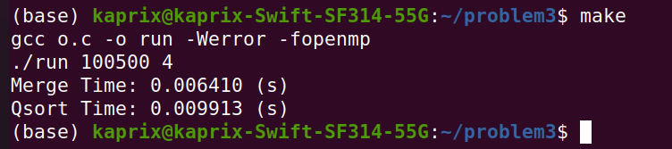
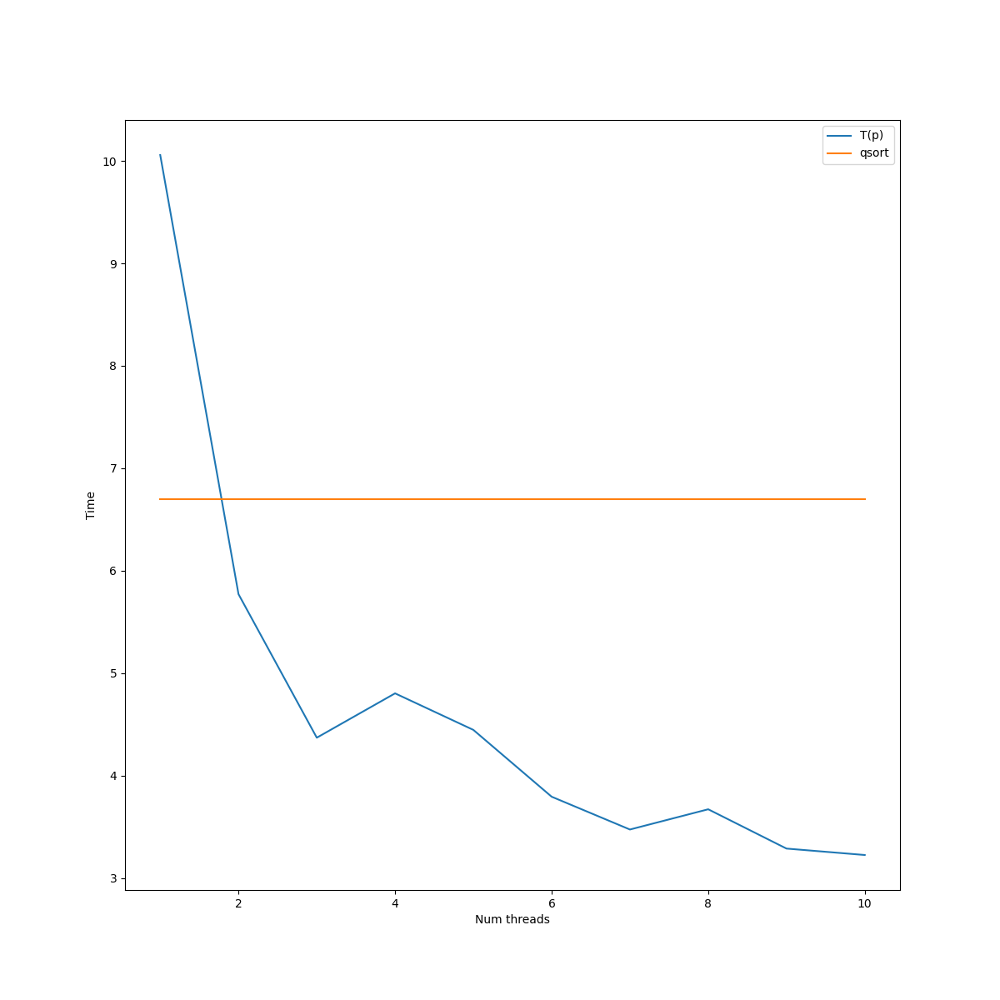
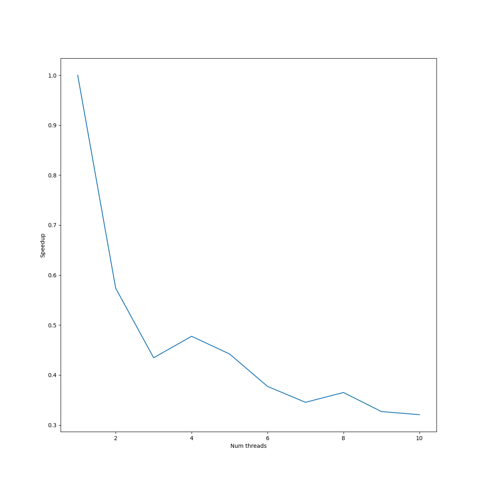
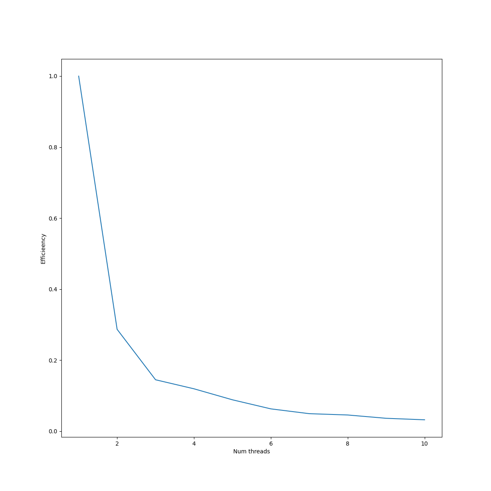

1. График T(p)

2. График S(p)

3. График E(p)

Выводы: задействуя параллелизм с помощью OpenMP, при сортировке массива можно получить ускорение по сравнению с более эффективным алгоритмом сортировки, но выполняющемся в однопоточном режиме.
